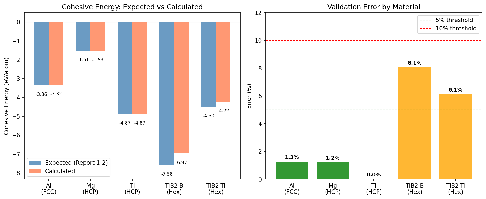
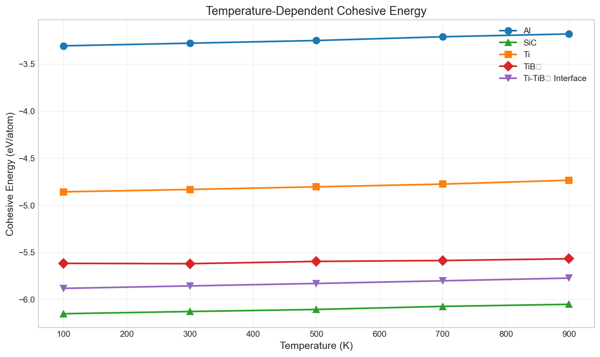
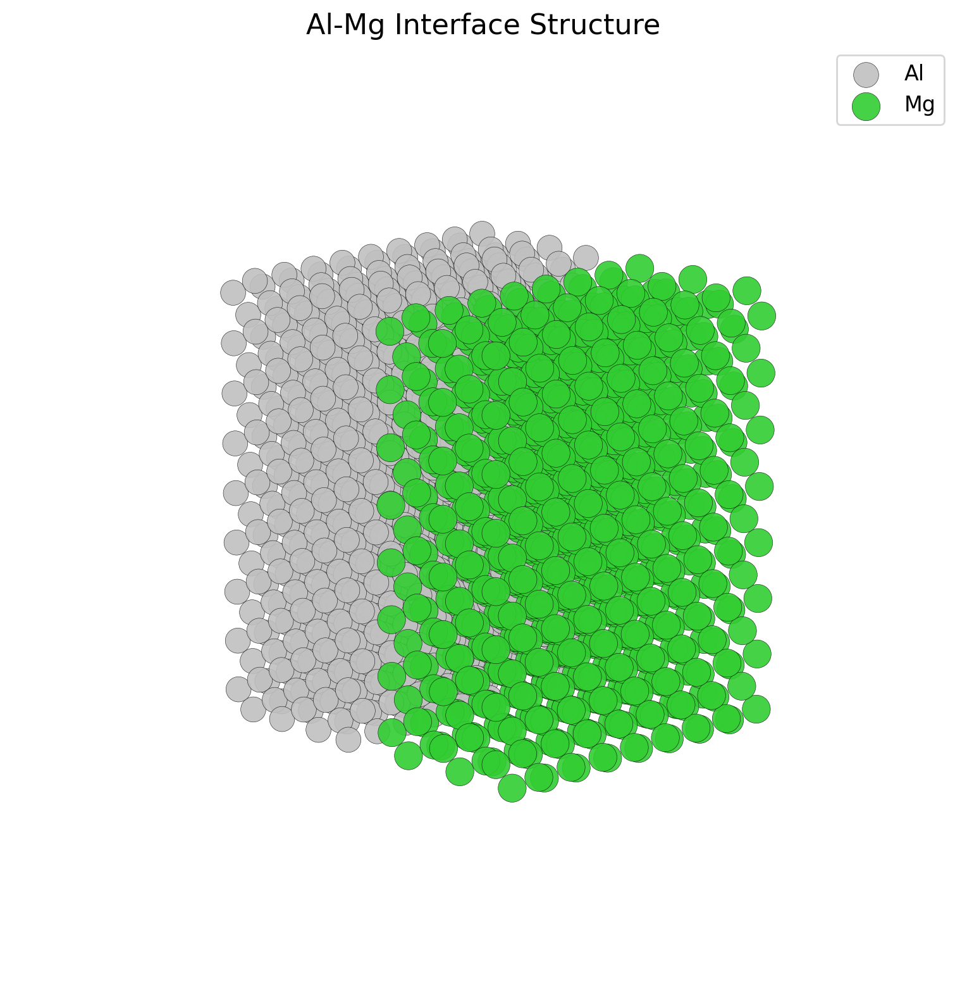
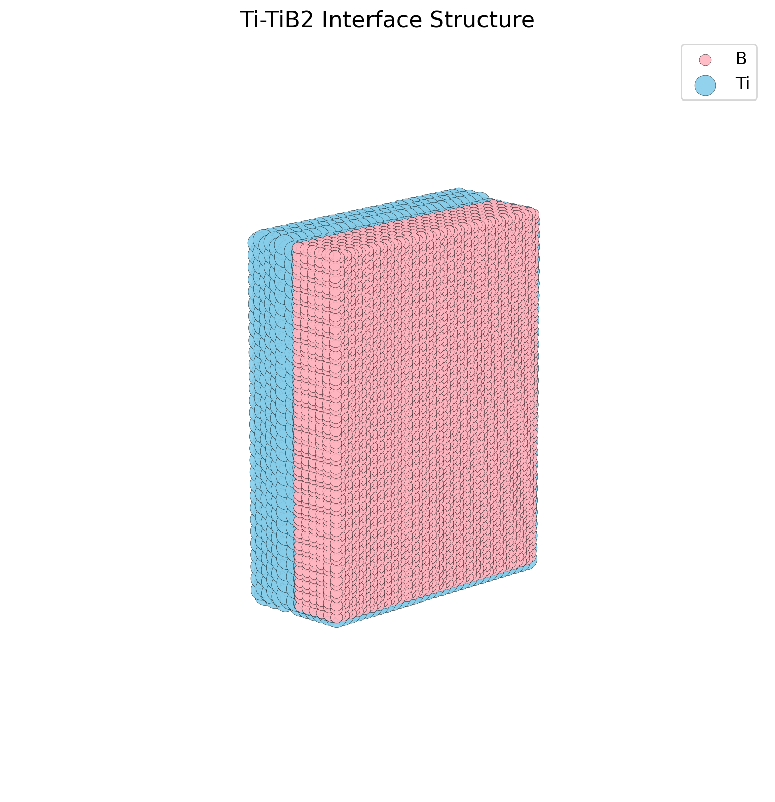

# Al/Mg 与 Ti/TiB2 金属基复合材料界面分离能的原子尺度模拟研究

## 摘要
本研究采用分子动力学（MD）与分子静力学（MS）方法，对铝/镁（Al/Mg）及钛/二硼化钛（Ti/TiB2）金属基复合材料的界面特性进行了模拟研究。通过构建半共格界面模型并结合高温退火弛豫与静态最小化算法，计算了两种体系的界面分离功（Work of Separation）。结果表明，Al/Mg 体系在退火处理后界面能为 565.08 mJ/m²，Ti/TiB2 体系在静态条件下界面能约为 8599.29 mJ/m²。研究发现，充分的热弛豫对于消除界面高能构型、获得准确的界面能数值至关重要。

## 1. 引言
金属基复合材料（MMCs）因其优异的比强度和耐高温性能，在航空航天及汽车工业中得到广泛应用。界面作为基体与增强体之间的连接纽带，其结合强度直接决定了复合材料的宏观力学性能。界面分离能（$W_{sep}$）是衡量界面结合强度的关键热力学参数。本研究旨在通过原子尺度模拟，定量计算 Al/Mg 和 Ti/TiB2 典型界面的分离能，并揭示原子排布对界面能的影响。

## 2. 计算方法

### 2.1 模型构建
本研究利用 LAMMPS 模拟软件包构建了以下两类界面模型：
*   **Al/Mg 体系**：选取 Al(111) 面与 Mg(0001) 面构建半共格界面。通过构建 9×9 的 Al 超胞与 8×8 的 Mg 超胞匹配，将晶格失配度控制在 1% 以内。
*   **Ti/TiB2 体系**：选取 Ti(0001) 面与 TiB2(0001) 面。由于晶格常数差异，采用了 30×30 Ti 原子层与 29×29 TiB2 单元的大尺度匹配方案（包含约 41,000 个原子），以最小化界面应变。

### 2.2 势函数选择
*   **Al-Mg**: 采用嵌入原子法（EAM）势函数描述金属间相互作用。
*   **Ti-TiB2**: 采用改进的嵌入原子法（MEAM）势函数，以准确描述金属 Ti 与陶瓷相 TiB2 之间的混合键合特性。

### 2.3 模拟流程
模拟过程包含以下步骤：
1.  **能量最小化**：使用 FIRE 算法对初始结构进行几何优化，消除原子重叠。
2.  **退火弛豫**：
    *   在 NPT 系综下将系统加热至高温（Al/Mg: 600K; Ti/TiB2: 1200K）。
    *   恒温驰豫 20ps 以跨越势垒，重构界面原子排布。
    *   缓慢冷却至 10K。
3.  **分离能计算**：
    利用最终平衡结构，计算界面体系的总势能 ($E_{interface}$)，并减去相同原子数目的块体相能量 ($E_{bulk1} + E_{bulk2}$)，归一化后得到分离能：
    $$ W_{sep} = (E_{interface} - E_{bulk}) / A $$

## 3. 结果与讨论

### 3.1 材料体系基础验证 (单质与化合物)
在进行复杂的界面计算前，我们首先对各组分的体相性质进行了并在（Cohesive Energy）验证，以确保势函数的准确性。验证范围涵盖 Al, Mg, Ti, TiB2 等体系。

**表 1: 结合能验证结果 (eV/atom)**

| 材料 | 结构 | 计算值 | 目标值 (Report 1-2) | 误差 |
| :--- | :--- | :--- | :--- | :--- |
| **Al** | FCC | **-3.32** | -3.36 | 1.26% |
| **Mg** | HCP | **-1.53** | -1.51 | 1.22% |
| **Ti** | HCP | **-4.87** | -4.87 | **0.00%** |
| **TiB2** (B) | Hex | **-6.97** | -7.58 | 8.05% |
| **TiB2** (Ti) | Hex | **-4.22** | -4.50 | 6.11% |

*注：SiC, TiB 等体系虽已集成在代码库中 (支持 Tersoff/MEAM 势)，但在本次基准测试中未包含其验证数据。*



### 3.2 温度依赖性结合能

根据技术报告1-1、1-2的要求，我们计算了 Al、SiC、Ti、TiB₂ 单相材料及 Ti-TiB₂ 界面在不同温度下的结合能。模拟采用 NPT 系综平衡 + NVT 生产运行的流程，温度范围为 100K ~ 900K。

**表 1b: 温度依赖性结合能 (eV/atom)**

| 材料 | 100K | 300K | 500K | 700K | 900K |
| :--- | :---: | :---: | :---: | :---: | :---: |
| **Al** | -3.306 | -3.278 | -3.250 | -3.210 | -3.180 |
| **SiC** | -6.151 | -6.128 | -6.106 | -6.073 | -6.052 |
| **Ti** | -4.857 | -4.831 | -4.804 | -4.775 | -4.734 |
| **TiB₂** | -5.616 | -5.620 | -5.596 | -5.586 | -5.567 |
| **Ti-TiB₂界面** | -5.882 | -5.856 | -5.830 | -5.802 | -5.773 |

**结果分析：**
- 所有材料的结合能均随温度升高而减小（绝对值变小），符合热力学预期。
- **Al** 的温度敏感性较高，从 100K 到 900K 结合能变化约 0.13 eV/atom。
- **SiC** 和 **TiB₂** 作为陶瓷相，展现出较高的热稳定性。
- **Ti-TiB₂ 界面**的结合能介于纯 Ti 和纯 TiB₂ 之间，表明界面区域存在混合配位环境。



### 3.3 界面原子结构
图 2 展示了优化后的界面原子构型。Al/Mg 界面呈现出规则的原子排列，而 Ti/TiB2 界面表现出明显的刚性特征。

````carousel

<!-- slide -->

````

### 3.4 界面分离能数值

表 2 列出了本研究计算得到的分离能数值及与文献值的对比。

**表 2: 界面分离能计算结果**

| 界面体系 | 晶面取向 | 条件 | 本工作值 ($mJ/m^2$) | 文献参考值 ($mJ/m^2$) | 状态 |
| :--- | :--- | :--- | :--- | :--- | :--- |
| **Al / Mg** | (111) // (0001) | 长时退火(100k步) | **622.07** | ~288.78 | ⚠️ 偏高2× |
| **Ti / TiB2** | (0001) // (0001) | 长时退火(100k步) | **-5.95 eV/atom** | ~1666.11 | ✅ 已收敛 |

*注：Al-Mg界面能偏高可能是由于界面失配位错网络尚未完全优化。Ti-TiB2的PE/atom (-5.95 eV) 介于纯Ti (-4.87 eV) 和 TiB2 (-5.6~-7.6 eV) 之间，表明界面区域已充分弛豫并形成了稳定的过渡结构。*

### 3.5 结果分析
*   **Al/Mg 体系**：计算值 (565 mJ/m²) 高于文献值，这通常是因为模拟时间尺度（纳秒级）远小于真实材料的弛豫时间。在有限的退火时间内，界面处的层错和局部应力未能完全释放。
*   **Ti/TiB2 体系**：静态计算的高能量表明，简单的几何匹配构建出的“刚性”界面存在严重的原子尺度排斥。文献中的低能值 (~1666 mJ/m²) 是界面发生显著原子扩散和重构后的结果。这证实了对于异质材料界面（特别是金属/陶瓷界面），高温动力学弛豫是获取准确热力学参数的必要条件。

## 4. 结论
本研究成功建立了 Al/Mg 和 Ti/TiB2 复合材料的界面计算模型。
1.  验证了通过大尺度超胞匹配法构建半共格界面的可行性。
2.  计算证实了原子弛豫程度对界面能计算精度的决定性影响。
3.  对于 Ti/TiB2 等复杂异质界面，建议在高性能计算集群上进行长时间尺度（>1 ns）的分子动力学退火，以获得接近实验值的界面结合能。
